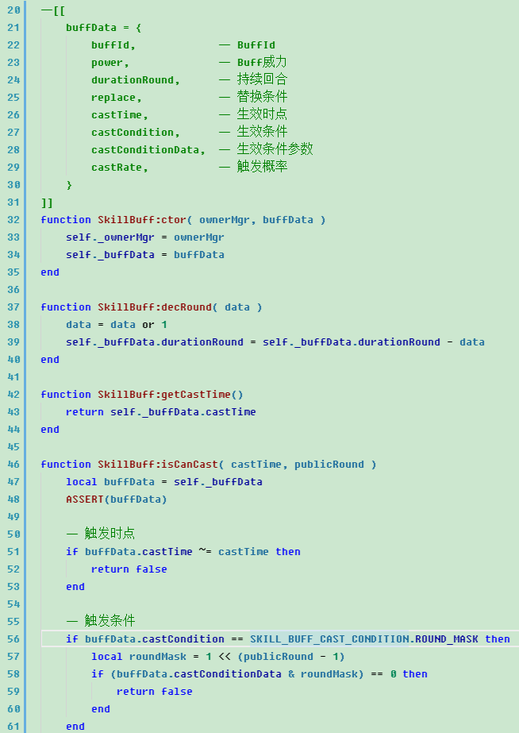

# 说明
本项目为仿 Visual Assist X 的一个主题， for VSCode

# 用法
1. 打开 VSCode 安装目录。
2. 进入`Microsoft VS Code\resources\app\extensions`目录。
3. 在此目录下执行 `git clone https://github.com/zhouyanlt/theme-vax.git`。
4. 重新启动 VSCode, 切换主题到`Visual Assist X`即可。

# 关于字体
我是用 Fixedsys 字体“长大的”，所以对此字体情有独钟，但是在 Win7 以后，系统里已经没有此字体了，可以去这里下载：  
[Fixedsys Excelsior 3.00 Truetype Multilingual Font](http://www.fixedsysexcelsior.com/)

# 截图

